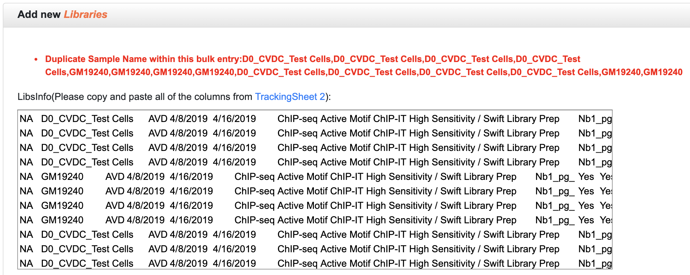
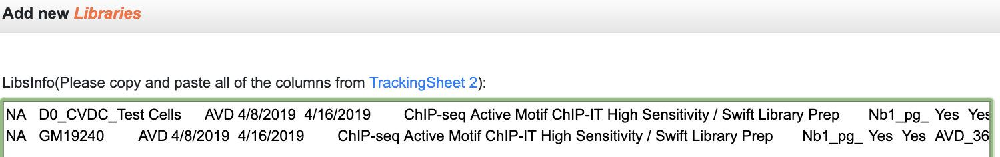
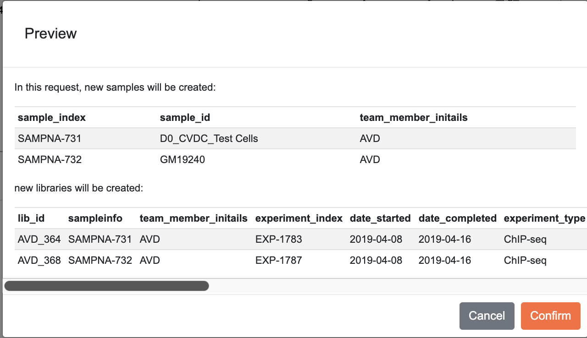
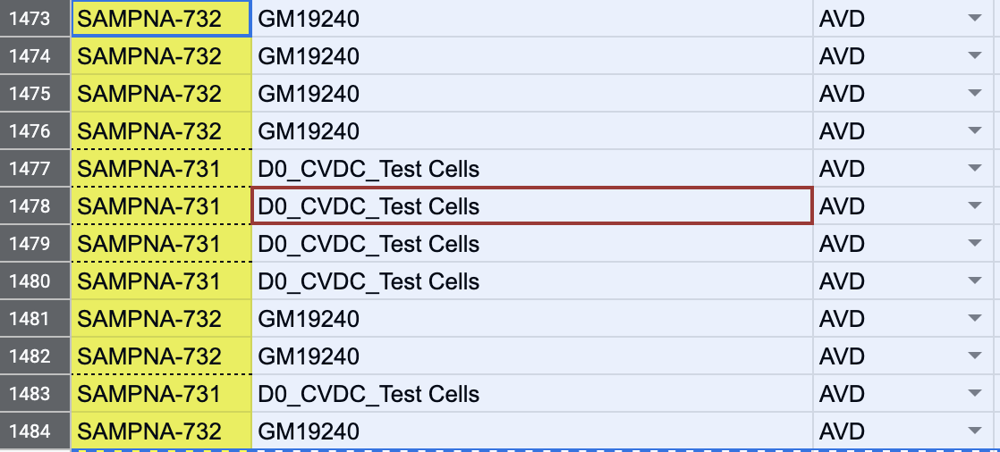
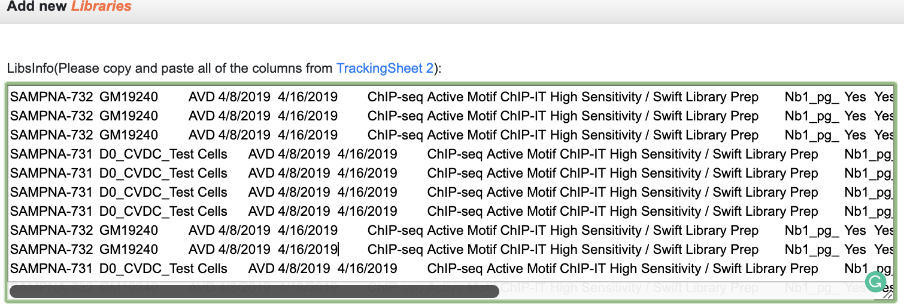

## Enter external libs with no Sample info

### With one lib each sample 

Just Create these Libs in Tracking sheet 2 with `NA` in `Sample Index` but with valid `sample name`. Then copy paste to [add new libs@LIMS](http://epigenomics.sdsc.edu:8000/metadata/libraries/adds/) 

### With multiple libs from same sample
If there are multiple libraries from the same sample, there you will enter a problem showing: duplicated sample name

Steps to enter these libs: 

1. Create Libs in Tracking sheet 2 with `NA` in `Sample Index` but with valid `sample name`

2. Copy created libs from Tracking Sheet 2 that have **unique** `sample name` to [add new libs@LIMS](http://epigenomics.sdsc.edu:8000/metadata/libraries/adds/) 

3. In preview page, record the automatically assigned `sample index` and then click `confirm` in LIMS to save these first set of libs. 

4. Paste the newly generated `sample index` in Tracking sheet 2 for the remaining libs that you haven't enter.

5. Paste the remaining libs to [add new libs@LIMS](http://epigenomics.sdsc.edu:8000/metadata/libraries/adds/).  Click save and confirm to save the remaining libs 

